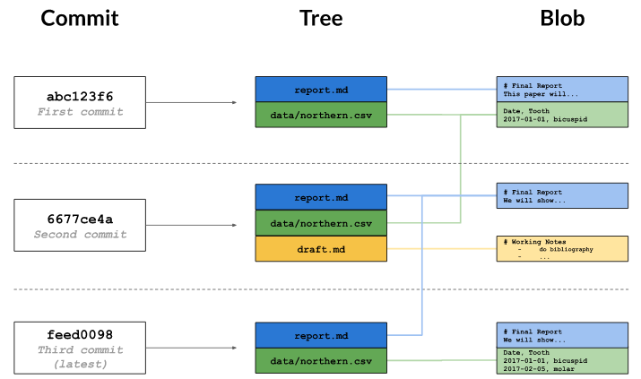
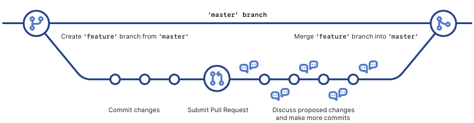
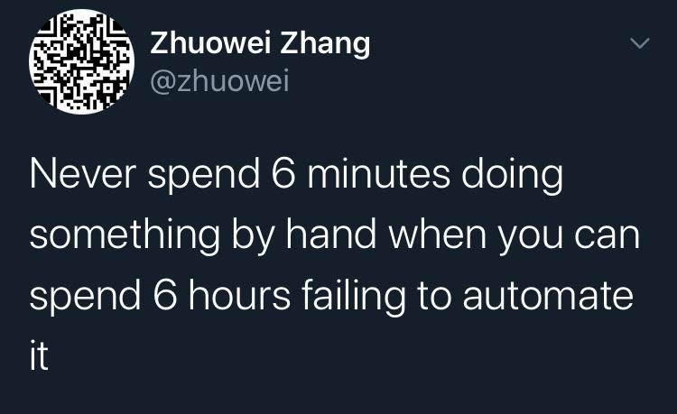

```{r setup, include=FALSE}
options(htmltools.dir.version = FALSE)
knitr::opts_chunk$set(echo=F)
```

# Contents

.pull-left[
- Collaborative data analysis

- Git for data analysis
  
  - Version control systems
  
  - Git vocabulary
  
  - Basic Git functions

- GitHub for collaborative work
  
  - Isn't Git enough?
  
  - Basic collaborating functions
  
- Hands-on example
]

--

.pull-right[


.footnote[Source: [xkcd](https://imgs.xkcd.com/comics/git.png)]
]

---

class: middle, center

# Collaborative data analysis

---

### Collaborative data analysis


.pull-left[
Implies solving at least the following issues:

- Centralize all operations and files

- Track all relevant procedures behind the analysis

- Make available the same copy of the project to any collaborator

- Create a workflow where collaborators can work at the same time handling conflicts

- Allow upscaling of the project

- Foster reproducibility of the project
]

--

.pull-right[

.footnote[Source: [xkcd](https://xkcd.com/2116/)]
]

---

class: middle, center

# Git for data analysis

## <font color="BC3417">Version control systems</font>

---

### Git

> Git is a distributed version-control system for tracking changes in source code during software development

.right[[Wikipedia](https://en.wikipedia.org/wiki/Git)]

--

_Oh wait, I'm not a software developer_ `r emo::ji("raised_eyebrow")`

> Git has been re-purposed by the data science community. In addition to using it for source code, we use it to manage the motley collection of files that make up typical data analytical projects, which often consist of data, figures, reports, and, yes, source code.

.right[[Happy Git with R](https://happygitwithr.com/big-picture.html#why-git)]

---

### Who will your collaborators be?

- The first problem to solve is _how to collaborate with **yourself**_

- Even working in pairs, things can get ugly without an **ordered process** 

- Projects may upscale in unexpected ways:
  
  - New collaborators
  
  - Reproducibility of results
  
  - Crowdsourced replications

- Downside: your collaborators also need to know Git & GitHub `r emo::ji("roll_eyes")`

  - Many tools for making the collaboration easier (e.g., GitHub desktop, GitKraken)
  
  - Future standard?

---

### What do you want to version control?

- It's important to assess what should your data analysis project track

  - Code, documentation, prose: `r emo::ji("heavy_check_mark")`
  - Figures & tables: `r emo::ji("heavy_check_mark")`
  - Data: `r emo::ji("warning")`
  - Software: `r emo::ji("warning")`

---

class: middle, center

# Git for data analysis

## <font color="BC3417">Git vocabulary</font>

---

### Vocabulary

.left-column[
- `commit`
  - Author
  - Message
  - Timestamp
- `repo`
- `diff`
- `tag`
]

.right-column[
```{r}
knitr::include_graphics("figures/commit-diff-sha-tag.png")
```

.footnote[Source: [Happy Git with R](https://happygitwithr.com/git-basics.html)]
]

---

### System rationale

.left-column[
Under the hood
- Efficient register
- Change-focused
]

.right-column[
```{r}

```
Source: [Datacamp](https://www.datacamp.com/)
]

---

class: middle, center

# Git for data analysis

## <font color="BC3417">Basic Git functions</font>

---

### Who am I?

.left-column[
- You have to be someone
  - Name
  - Email

- Everything in Git is a command
]

.right-column[
```{bash echo = T}
git config --list
```
]

---

### Where am I?

.left-column[
- You're always in some repo
  - Local
  - Remote
  - Both
  
- There is a history
  - **Actual state**
  - Log
]

.right-column[
```{bash echo = T}
git status
```
]

---

### Where am I?

.left-column[
- You're always in some repo
  - Local
  - Remote
  - Both
  
- There is a history
  - Actual state
  - **Log**
]

.right-column[
```{bash echo = T}
git log
```
]

---

### Interfaces

- Originally, Git was designed for being used through the Command Line Interface

- Thankfully, there are many interfaces that can make Git tasks much easier, e.g:

  - GitHub Desktop
  
  - **GitKraken**
  
  - RStudio
  
  - Atom

---

class: middle, center

# GitHub for collaborative work

## <font color="BC3417">Isn't Git enough?</font>

---

### Isn't Git enough?

- In principle, Git just tracks your local machine

- Any collaboration or publication beyond your local machine will need to incorporate **remotes**, e.g:
  - GitHub
  
  - Gitlab
  
  - Bitbucket

---

class: middle, center

# GitHub for collaborative work

## <font color="BC3417">Basic collaborating functions</font>

---

###  Fork & Pull model

Most common model where

.pull-left[
- There is an _owner_ or _project leader_ with and **upstream repo**

- She/he assigns rights to _collaborators_

  - Every _collaborator_ has a **fork** of the project

- Collaborators do not have **push** access to main (upstream) repo

- _Owner_ accepts **Pull Requests** from collaborators, reviews them, then **merges** them into main repo
]

.pull-right[

- Every _collaborator_ develops major changes in **branches** (parallel universes), e.g:
  - Processing data
  - Specific analysis
  - Report or paper draft
  
- When finished, the branch is merged into the `master` branch

```{r}

```

.footnote[Source: [GitHub cheatsheet](https://github.github.com/training-kit/downloads/github-git-cheat-sheet.pdf)]
]


---

### Does it worth it?

.pull-left[
```{r}

```
]

--

.pull-right[
- Critique to an _American Economic Review_ paper

```{r}

```
.footnote[Source: [Herndon et al., 2013](https://www.peri.umass.edu/images/WP322.pdf)]
]

---

class: middle, center

# Hands-on example

---

### Example

Let's conduct an example considering the general workflow for collaborating through a Git repo

  - Check the step-by-step activity [here](https://github.com/Crismoc/collaborative_analysis/blob/master/activity/activity.md)

